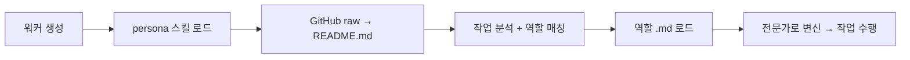

<p align="center">
  
  
  
  
</p>

<br>

<p align="center">
  <picture>
    <source media="(prefers-color-scheme: dark)" srcset="https://capsule-render.vercel.app/api?type=waving&color=0:8A2BE2,100:FF6B6B&height=200&section=header&text=🎭%20Hermes%20Persona&fontSize=60&fontColor=fff&animation=fadeIn">
    
  </picture>
</p>

<p align="center">
  <b>칸반 워커를 위한 전문가 페르소나 주입 시스템</b><br>
  <i>Hermes Agent × agency-agents — 210개 역할, 제로 로컬 저장소</i>
</p>

<br>

---

## 📋 개요

**Hermes Persona**는 [Hermes Agent](https://github.com/NousResearch/hermes-agent)의 칸반 워커가 작업 분석 후, [agency-agents](https://github.com/msitarzewski/agency-agents)의 210개 전문가 역할 중 최적의 페르소나를 자동 선택하여 작업을 수행하도록 하는 시스템이다.



---

## 🔧 Hermes Agent 변경사항

Hermes Persona가 Hermes Agent에 가하는 변경은 **단 하나**다.

### 수정 파일

```
agent/prompt_builder.py — KANBAN_GUIDANCE 상수
```

### 수정 내용

기존 `KANBAN_GUIDANCE`의 하단에 `## persona — role adoption` 섹션을 추가한다. 이 섹션은 칸반 워커에게 다음과 같은 지시를 내린다:

```python
"## persona — role adoption\n"
"\n"
"If you have the `persona` skill loaded:\n"
"1. **Read your task.** `kanban_show()` then analyze the task body.\n"
"2. **Pick a role.** Fetch the README from the agency-agents repository:\n"
"   `curl -s https://raw.githubusercontent.com/msitarzewski/agency-agents/main/README.md`\n"
"   → scan 17 categories, 210+ specialist roles, pick the best fit.\n"
"3. **Load the personality.** Fetch the role's full specification:\n"
"   `curl -s https://raw.githubusercontent.com/msitarzewski/agency-agents/main/{category}/{filename}.md`\n"
"4. **Adopt it.** Become that expert. Follow its rules, standards, and process.\n"
"5. **Act.** Work on your task as that role.\n"
"If no matching role exists, proceed as a generalist."
```

### 동작 원리

| 단계 | 설명 |
|------|------|
| `KANBAN_GUIDANCE` | 칸반 워커가 생성될 때마다 시스템 프롬프트에 주입됨 |
| `--skill persona` | 워커에게 `persona` 스킬이 로드되었음을 알림 |
| `curl ... README.md` | 로컬 저장소 없이 GitHub raw URL로 직접 접근 |
| 역할 선정 | README의 17개 카테고리 테이블에서 작업에 가장 적합한 역할 선택 |
| `.md` 로드 | 선택한 역할의 상세 규격서를 raw URL로 가져와 페르소나 주입 |

> **제로 로컬 저장소.** git clone, pull, 관리 불필요. curl 요청 한 번으로 모든 정보를 실시간으로 가져온다.

---

## 🚀 설치

### 자동 설치

```bash
bash <(curl -sSL https://raw.githubusercontent.com/Caixa-git/hermes-persona/main/install.sh)
```

### 수동 설치

```bash
# 1. persona 스킬 디렉토리 생성
mkdir -p ~/.hermes/skills/persona

# 2. SKILL.md 다운로드
curl -sSL https://raw.githubusercontent.com/Caixa-git/hermes-persona/main/skills/persona/SKILL.md \
  -o ~/.hermes/skills/persona/SKILL.md

# 3. KANBAN_GUIDANCE 패치 (수동)
# ~/.hermes/hermes-agent/agent/prompt_builder.py 열어서
# ## persona — role adoption 섹션 추가 (위 참조)
```

---

## 💡 사용법

```bash
# 워커가 스스로 역할을 찾아서 작업
hermes kanban create 'REST API 서버 구축 (JWT 인증 포함)' --skill persona
# → Backend Architect 선택 → .md 로드 → 전문가 모드로 작업

# 프론트엔드 작업
hermes kanban create '대시보드 UI 컴포넌트 개발' --skill persona
# → Frontend Developer 선택

# 보안 감사
hermes kanban create 'API 취약점 스캔 및 대응' --skill persona
# → Security Engineer 선택
```

**워커의 판단 흐름 예시:**

```
작업 분석: "REST API 서버 구축 (JWT 인증 포함)"
  → README 스캔 중...
  → "Backend Architect": API 설계, 인증 시스템, 스키마 검증
  → Security Engineer: 취약점 평가, 보안 설계 검토
  → 1순위: Backend Architect (직접 구축이 주목적)
  → engineering-backend-architect.md 로드
  → Security-First Architecture 원칙 적용
  → 작업 시작
```

---

## 🏗️ 프로젝트 구조

```
hermes-persona/
├── README.md                  # 이 파일
├── install.sh                 # 1-커맨드 설치 스크립트
└── skills/
    └── persona/
        └── SKILL.md           # Hermes Agent 스킬 정의
```

---

## 🗺️ 로드맵

- [x] **기본 역할 채택** — README 스캔 → 역할 선정 → .md 로드
- [ ] **지능형 역할 선택** — 작업 분석 기반 최적 역할 추천 (에이전트/직업심리학 논문 활용)
- [ ] **멀티 역할 구성** — 단일 작업을 여러 전문가에게 분할 할당
- [ ] **성과 피드백 루프** — 역할별 작업 결과 분석 및 추천 개선

---

## 🙏 크레딧

| 프로젝트 | 설명 |
|----------|------|
| [agency-agents](https://github.com/msitarzewski/agency-agents) | **msitarzewski** — 17개 도메인, 210개 전문가 역할을 정교하게 정의한 카탈로그. 이 시스템의 핵심 데이터 소스 |
| [Hermes Agent](https://github.com/NousResearch/hermes-agent) | **Nous Research** — 칸반 기반 멀티에이전트 오케스트레이션 프레임워크. 스킬 주입과 태스크 분배를 가능하게 한 런타임 |

---

<p align="center">
  <sub>🎭 Pick your mask. Become the expert.</sub><br>
  <sub>Created by <a href="https://github.com/Caixa-git">Caixa-git</a></sub>
</p>
