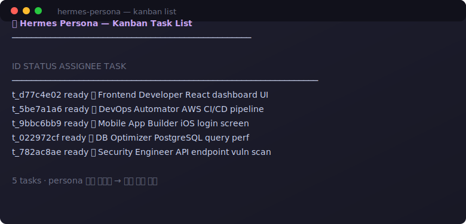

<p align="center">
  <samp>
    <strong>🎭 Hermes Persona</strong><br>
    <sub>칸반 워커가 작업 분석 후 210개 전문가 역할 중 최적을 선택합니다</sub>
  </samp>
</p>

<p align="center">
  <a href="https://github.com/NousResearch/hermes-agent">
    
  </a>
  <a href="https://github.com/msitarzewski/agency-agents">
    
  </a>
  <a href="https://github.com/Caixa-git/hermes-persona/blob/main/LICENSE">
    
  </a>
  
</p>

<br>

---

## 📦 설치

### 전제 조건

Hermes Agent가 설치되어 있어야 합니다.<br>
설치: `curl -fsSL https://raw.githubusercontent.com/NousResearch/hermes-agent/main/scripts/install.sh | bash`

### Hermes Persona 설치

```bash
bash <(curl -sSL https://raw.githubusercontent.com/Caixa-git/hermes-persona/main/install.sh)
```

### 설치 확인

```bash
hermes skills list | grep persona
# → persona                  │ local   │ enabled
```

---

<br>

<p align="center">
  
</p>

## 🎯 사용법

칸반 태스크를 만들 때 `--skill persona`를 붙이면 끝입니다.

```bash
hermes kanban create "REST API 서버를 JWT 인증과 함께 구축" --skill persona
```

워커가 생성되면 자동으로:

1. **persona 스킬을 로드**
2. **GitHub에서 agency-agents README를 실시간 조회** (`curl`)
3. **작업 내용 분석 → 210개 역할 중 최적 선택**
4. **🎭 역할 채택** — 칸반 이벤트에 `🎭 Role adopted: 🏗️ Backend Architect` 기록
5. **전문가 모드로 작업 수행**

### 실제 태스크 보기

```text
hermes kanban list

▶ t_d77c4e02  ready  (unassigned)  "React dashboard UI 컴포넌트 개발"
▶ t_5be7a1a6  ready  (unassigned)  "AWS 인프라 CI/CD 파이프라인 구축"
▶ t_9bbc6bb9  ready  (unassigned)  "모바일 iOS 앱 로그인 화면 구현"
▶ t_022972cf  ready  (unassigned)  "PostgreSQL 쿼리 성능 최적화"
▶ t_782ac8ae  ready  (unassigned)  "API 엔드포인트 보안 취약점 진단"
```

워커가 각 태스크를 실행하면 내부적으로 다음과 같은 역할을 선택합니다:

| 태스크 | 선택된 역할 | 이모지 |
|--------|------------|--------|
| React dashboard UI | Frontend Developer | 🎨 |
| CI/CD 파이프라인 구축 | DevOps Automator | 🚀 |
| iOS 앱 로그인 화면 | Mobile App Builder | 📱 |
| PostgreSQL 최적화 | Database Optimizer | 🗄️ |
| 보안 취약점 진단 | Security Engineer | 🔒 |

---

## 🔍 동작 방식

```
워커 생성 → persona 스킬 로드 → GitHub raw ← README 조회
    → 작업 분석 → 210개 역할 중 매칭 → 역할 .md 로드
    → 🎭 전문가 모드 ON → 태스크 실행
```

**로컬에 저장되는 파일은 단 1개**: `~/.hermes/skills/persona/SKILL.md` (1.3KB)

**git clone은 전혀 필요 없습니다.** 모든 역할 정보는 GitHub raw URL로 실시간 조회합니다.

---

## 🔧 Hermes Agent 변경 사항

> Hermes Persona가 수정하는 것은 단 1곳입니다. persona 스킬이 없는 워커는 동작에 아무 변화가 없습니다.

| 항목 | 내용 |
|------|------|
| 수정 파일 | `agent/prompt_builder.py` — `KANBAN_GUIDANCE` 상수 |
| 추가된 코드 | `## persona — role adoption` 섹션 (13줄) |
| 영향 범위 | persona 스킬이 **로드된 워커만** 영향을 받음 |

<details>
<summary>추가된 코드 보기</summary>

```python
"## persona — role adoption\n"
"\n"
"If you have the `persona` skill loaded:\n"
"1. **Analyze your task.** `kanban_show()` then analyze the task body.\n"
"2. **Pick a role.** Fetch the README from the agency-agents repository:\n"
"   `curl -s https://raw.githubusercontent.com/msitarzewski/agency-agents/main/README.md`\n"
"   → scan 17 categories, 210+ specialist roles, pick the best fit.\n"
"   Note the role's **emoji** from the README table.\n"
"3. **Announce adoption.** Call `kanban_heartbeat(note=...` with:\n"
"   `🎭 Role adopted: {emoji} {role-name}`\n"
"4. **Load the personality.** Fetch the role's full specification:\n"
"   `curl -s https://raw.githubusercontent.com/msitarzewski/agency-agents/main/{category}/{filename}.md`\n"
"5. **Adopt it.** Become that expert. Follow its rules, standards, and process.\n"
"6. **Act.** Work on your task as that role.\n"
"If no matching role exists, proceed as a generalist."
```

</details>

---

## 📁 프로젝트 구조

```
hermes-persona/
├── README.md                # 이 파일
├── install.sh               # 1-커맨드 설치 스크립트
├── test_persona.py          # 자동화 테스트 (47개)
└── skills/
    └── persona/
        └── SKILL.md         # Hermes Agent 스킬 파일
```

---

## 로드맵

- [x] 기본 역할 채택 — README 스캔 → 역할 선정 → .md 로드 (✅ 47/47 테스트 통과)
- [x] 이모지 역할 표시 — 칸반 이벤트에 `🎭 Role adopted: 🏗️ Role Name` 기록
- [ ] **지능형 역할 선택** — 심리학/직무 분석 논문 기반 최적 역할 추천
- [ ] 멀티 역할 구성 — 단일 작업을 복수 전문가에게 분할
- [ ] 성과 피드백 루프 — 역할 선택 이력 기반 추천 개선

---

## 크레딧

| 프로젝트 | 제작자 | 설명 |
|----------|--------|------|
| [agency-agents](https://github.com/msitarzewski/agency-agents) | [msitarzewski](https://github.com/msitarzewski) | 15개 분야 172개 전문가 역할 카탈로그 |
| [Hermes Agent](https://github.com/NousResearch/hermes-agent) | [Nous Research](https://nousresearch.com) | 칸반 기반 멀티에이전트 오케스트레이션 |

---

<p align="center">
  <sub>🎭 Pick your mask. Become the expert.</sub><br>
  <sub>만든 사람 <a href="https://github.com/Caixa-git">Caixa-git</a></sub>
</p>
