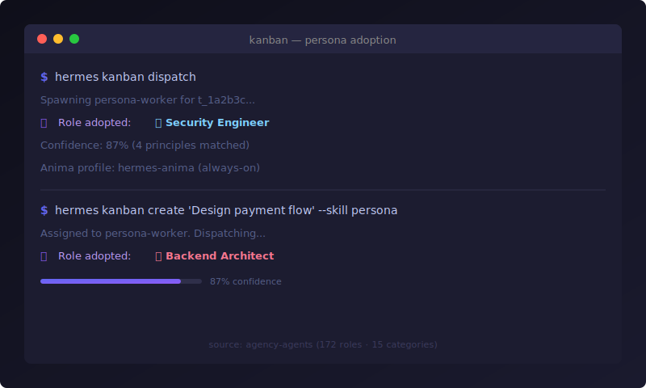

<p align="center">
  
</p>

<p align="center">
  <h2 align="center">persona</h2>
  <p align="center"><strong>Expert role adoption</strong> for kanban workers —<br>172 specialists across 15 categories, auto-selected by task context.</p>
</p>

<p align="center">
  <a href="https://github.com/msitarzewski/agency-agents"></a>
  <a href="https://github.com/msitarzewski/agency-agents"></a>
  <a href="./LICENSE"></a>
  <a href="https://github.com/Caixa-git/hermes-persona/releases"></a>
  <a href="https://github.com/Caixa-git/hermes-persona/actions"></a>
</p>

<p align="center">
  
</p>

---

## Quick start

```bash
# In chat
use persona

# From CLI
hermes kanban create 'Audit OWASP top 10' --skill persona
hermes kanban assign t_xxxx persona-worker
hermes kanban dispatch
# → 🎭 Security Engineer
```

---

## How it works

```
Task ──→ scan 172 roles ──→ fit >30%? ──→ adopt specialist
                                  ↓
                             ≤30%? ──→ no role (generalist fallback)
```

| Principle | Paper |
|-----------|-------|
| Output alignment | MetaGPT (ICLR 2024) |
| Boundary clarity | CAMEL (NeurIPS 2023) |
| Decomposition priority | AgentVerse (ICML 2024) |
| Confidence threshold | AutoGen (2023) |

---

## Persona vs Anima

| | Persona | Anima |
|---|---|---|
| **Nature** | Social role (인공적) | Core identity (본질) |
| **Activation** | `--skill persona` — opt-in | Always active |
| **Priority** | — | Anima > Persona |

[hermes-anima](https://github.com/Caixa-git/hermes-anima) → always-on OCEAN identity.

---

## Install

```bash
bash <(curl -sSL https://raw.githubusercontent.com/Caixa-git/hermes-persona/main/install.sh)
```

Verify: `python3 test_benchmark.py` (37 tests).

---

<p align="center">
  <a href="https://github.com/Caixa-git/hermes-anima">anima</a> ·
  <a href="https://github.com/msitarzewski/agency-agents">agency-agents</a> ·
  <a href="./CONTRIBUTING.md">contributing</a>
</p>
